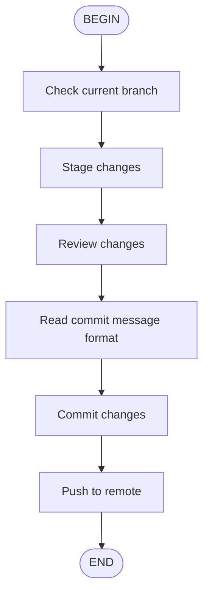

## Usage
/flow:commit-push

## Steps
1. **Check current branch**: Use `Shell` to run `git branch --show-current` to get the current branch name.
2. **Stage changes**: Run `git add -A` using `Shell`.
3. **Review changes**: Use `Shell` to run `git diff --staged` to review the staged changes.
4. **Read commit message format**: Use `fast_read_file` to read `.windsurf/rules/commit-message-format.md` for guidelines.
5. **Commit changes**: Use `Shell` to run `git commit -m "<message>"`, where the message follows the format from step 4.
6. **Push to remote**: Use `Shell` to run `git push -u origin <current-branch>`.

## Usage Examples

### Safe Batch Execution
```bash
MSG="fix: Remove unnecessary debug log output" \
BRANCH=$(git branch --show-current) && \
git add -A && git commit -m "$MSG" && git push -u origin "$BRANCH"
```

### Step-by-Step Execution
```bash
# Get current branch
BRANCH=$(git branch --show-current)

# Stage changes
git add -A

# Commit with message
git commit -m "fix: Remove unnecessary debug log output"

# Push to remote
git push -u origin "$BRANCH"
```

## Notes
- Always run `git status` or `git diff` to review changes before committing.
- Ensure quality checks (lint, test, build) are passed before committing.
- Follow commit message conventions as per `.windsurf/rules/commit-message-format.md`.