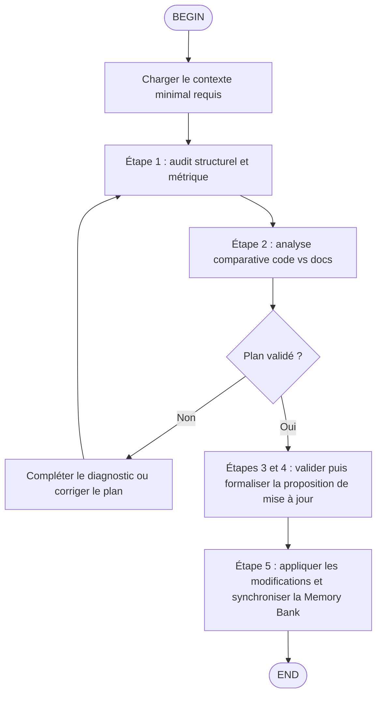

# Flow Overview
**TL;DR**: This flow keeps Kimi Proxy documentation aligned with the codebase by auditing the real source first, generating a validated update plan, applying documentation-writing checkpoints, then synchronizing memory-bank traces with absolute paths.

The source of truth is always the code analyzed with tools. Existing docs come second. Memory-bank context comes last and is read selectively.

# Node Details
## B
- Lire uniquement `/home/kidpixel/kimi-proxy/memory-bank/activeContext.md` avec `fast_read_file` au démarrage.
- Ne lire d'autres fichiers memory-bank que si une divergence majeure est détectée pendant le diagnostic.
- Utiliser des chemins absolus pour tout accès à `/home/kidpixel/kimi-proxy/memory-bank/`.
- Outils autorisés : fast-filesystem (`fast_read_file`, `fast_list_directory`, `fast_search_files`, `edit_file`), ripgrep (`search`, `advanced-search`, `count-matches`) et `bash` limité aux audits (`tree`, `cloc`, `radon`, `ls`).

## C
- Exécuter l'audit structurel et métrique du code, en privilégiant l'architecture 5 couches de `/home/kidpixel/kimi-proxy/src/kimi_proxy/`.
- Vérifier au minimum : cartographie, volumétrie, endpoints API, modules frontend, schémas ou migrations de base, configuration providers/modèles, métriques et monitoring.
- Filtrer le bruit de scan pour exclure les données, caches et dépendances volumineuses.
- Considérer la règle de couverture documentaire : tout endpoint détecté doit avoir une documentation API correspondante.

## D
- Comparer le code, la documentation existante et le contexte memory-bank selon l'ordre de priorité suivant : Code > Documentation existante > Mémoire.
- Produire un plan de mise à jour avant toute écriture.
- Classer chaque cible documentaire comme `Obsolète`, `Incomplet` ou `Manquant`.
- Préparer des propositions de correction directement ancrées dans les observations du code.

## E
- La décision attend une sortie explicite : `<choice>Oui</choice>` si le plan est complet, traçable et justifié par le code ; `<choice>Non</choice>` sinon.
- Si la réponse est `Non`, revenir à l'audit ou compléter l'analyse comparative avant toute rédaction.
- Aucun passage à l'application n'est autorisé sans validation du plan.

## F
- Compléter les audits manquants, affiner les métriques ou corriger les diagnostics insuffisamment sourcés.
- Réévaluer les écarts entre code et documentation jusqu'à obtenir un plan défendable.

## G
- Formaliser la proposition de mise à jour en préservant la logique des étapes 3 et 4 du workflow legacy : validation du plan puis préparation explicite de la proposition de rédaction.
- Intégrer les checkpoints du skill documentation : TL;DR, problem-first opening, comparaison ❌/✅, trade-offs si applicable, Golden Rule, évitement des artefacts AI, vérification de ponctuation, conformité à l'architecture 5 couches.
- Ajouter la traçabilité demandée dans la proposition : modèle documentaire utilisé, éléments du skill appliqués, patterns système référencés.
- Préparer aussi les hooks d'automation : note de validation Git, blocage si checkpoints non cochés, audit trail interne, sync `progress.md` et `decisionLog.md`.

## H
- Après validation, appliquer les modifications via `edit_file`.
- Mettre à jour la Memory Bank uniquement avec `edit_file` et des timestamps au format `[YYYY-MM-DD HH:MM:SS]`.
- Limiter chaque modification memory-bank à une lecture ciblée préalable pour réduire le bruit contextuel.
- Finaliser avec un résumé clair des fichiers modifiés et des écarts couverts.

# Guardrails
- Ne jamais traiter la memory-bank comme source principale de vérité.
- Ne jamais utiliser d'outils hors liste autorisée.
- Ne jamais appliquer de modification documentaire avant validation explicite du plan.
- Ne jamais terminer le flow si les checkpoints rédactionnels ne sont pas cochés.
- Toujours utiliser des chemins absolus pour les fichiers memory-bank.

# Output Contract
- Restituer un plan de mise à jour traçable avant écriture.
- Après application, restituer la liste des fichiers documentaires modifiés, les preuves d'audit utilisées et le statut de synchronisation memory-bank.
- Mentionner explicitement la migration des triggers legacy vers les invocations Kimi Code.

# Legacy Trigger Mapping
- Ancien trigger : `/docs-updater`
- Nouveau trigger standard : `/skill:docs-updater`
- Nouveau trigger flow : `/flow:docs-updater`
