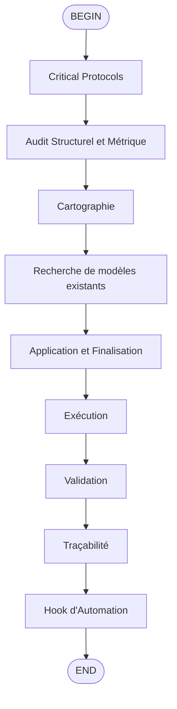

## Usage
/flow:docs-updater

## Critical Protocols
1. **Outils autorisés** : MCP fast-filesystem (`fast_read_file`, `fast_list_directory`, `fast_search_files`, `edit_file`), MCP ripgrep (`search`, `advanced-search`, `count-matches`), et `Shell` pour les audits (`tree`, `cloc`, `radon`, `ls`).
2. **Contexte** : Initialiser le contexte en appelant l'outil `fast_read_file` pour lire UNIQUEMENT `activeContext.md`. Ne lire les autres fichiers de la Memory Bank que si une divergence majeure est détectée lors du diagnostic.
3. **Source de Vérité** : Le Code (analysé par outils) > La Documentation existante > La Mémoire.
4. **Sécurité Memory Bank** : Utilisez les outils fast-filesystem (fast_*) pour accéder aux fichiers memory-bank avec des chemins absolus dans `/home/kidpixel/kimi-proxy/memory-bank/`.

## Étape 1 — Audit Structurel et Métrique
1. **Cartographie (Filtre Bruit)** :
   - Exécuter `tree -L 3 -I '__pycache__|venv|node_modules|.git'` pour visualiser la structure du projet.
   - Utiliser `cloc` et `radon` pour analyser les métriques de code (lignes de code, complexité, etc.).
   - Analyser les résultats pour identifier les zones nécessitant une documentation.
2. **Recherche de modèles existants** :
   - Utiliser `search` ou `advanced-search` pour trouver des fichiers de documentation similaires.
   - Vérifier les patterns système dans `systemPatterns.md`.

## Étape 5 — Application et Finalisation
1. **Exécution** :
   - Après validation, utiliser `edit_file` pour mettre à jour les fichiers de documentation.
   - Mettre à jour la Memory Bank en utilisant EXCLUSIVEMENT l'outil `edit_file` avec timestamps [YYYY-MM-DD HH:MM:SS].
2. **Validation** :
   - Vérifier la checklist « Avoiding AI-Generated Feel ».
   - Vérifier la ponctuation (remplacer " - " par ;/:/—).
3. **Traçabilité** :
   - Modèle : [Article deep-dive | README | Technique]
   - Éléments appliqués : TL;DR ✔, Problem-First ✔, Comparaison ✔, Trade-offs ✔, Golden Rule ✔
   - Patterns système : [Pattern 1, Pattern 6, Pattern 14, etc.]
4. **Hook d'Automation** :
   - Validation Git : Commentaire de commit « Guidé par documentation/SKILL.md — sections: [liste] »
   - Memory Bank sync : Mise à jour automatique de `progress.md` et `decisionLog.md`

**Locking Instruction:** Utilisez les outils fast-filesystem (fast_*) pour accéder aux fichiers memory-bank avec des chemins absolus dans `/home/kidpixel/kimi-proxy/memory-bank/`.