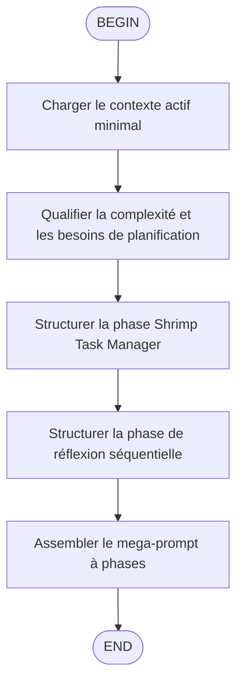

# Flow Overview
**TL;DR**: This flow converts a complex user request into a single Markdown mega-prompt that forces a downstream agent to work through context loading, Shrimp planning, sequential reasoning, staged implementation, and verification without executing the task during prompt generation.

# Node Details
## B
- Lire `/home/kidpixel/kimi-proxy/memory-bank/activeContext.md` avec `fast_read_file` pour comprendre le contexte global du dépôt.
- Charger seulement le contexte minimal requis pour cadrer la demande complexe.

## C
- Déterminer si la demande nécessite explicitement une planification détaillée, une décomposition en sous-tâches et une réflexion séquentielle.
- Préserver le rôle `ARCHITECTE TECHNIQUE SENIOR` et le verrou de non-exécution.

## D
- Intégrer dans le mega-prompt les phases Shrimp Task Manager et la liste explicite des outils autorisés : `plan_task`, `analyze_task`, `reflect_task`, `split_tasks`, `list_tasks`, `execute_task`, `verify_task`, `delete_task`, `clear_all_tasks`, `update_task`, `query_task`, `get_task_detail`, `process_thought`, `init_project_rules`, `research_mode`.
- Préserver la logique de planification : créer le brief, analyser, découper, évaluer la faisabilité et les risques.

## E
- Ajouter la phase de réflexion séquentielle avant chaque étape majeure.
- Exiger la validation des dépendances, des risques et des blocages potentiels avec les outils de réflexion séquentielle.

## F
- Produire un unique bloc de code Markdown contenant les sections de cadrage et les cinq phases obligatoires : compréhension du contexte, planification Shrimp, réflexion séquentielle, implémentation étagée, vérification.
- Préserver les contraintes critiques : ne jamais exécuter la tâche, ne jamais générer de code, ne jamais préfixer les outils par `mcp*_`.
- Inclure les contraintes de compatibilité projet : respecter `codingstandards.md`, ne pas casser l'architecture existante, utiliser uniquement les skills activés.

# Guardrails
- Ne jamais exécuter la tâche décrite par l'utilisateur.
- Ne jamais générer de code fonctionnel.
- La réponse finale doit être uniquement un bloc Markdown contenant le mega-prompt.
- Ne jamais ajouter de préfixe `mcp` aux noms d'outils dans le prompt final.
- Préserver les cinq phases du protocole legacy sans dilution.

# Output Contract
- Retourner exactement un bloc de code Markdown.
- Ce bloc doit contenir un protocole d'exécution structuré avec les cinq phases legacy.
- Le cadrage doit rester orienté planification et orchestration, jamais implémentation directe.

# Legacy Trigger Mapping
- Ancien trigger : `/enhance_complex`
- Nouveau trigger standard : `/skill:enhance-complex-architect`
- Nouveau trigger flow : `/flow:enhance-complex-architect`
