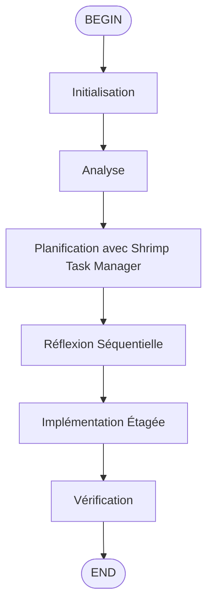

## Usage
/flow:enhance-complex

## Critical Rules
- Ne jamais exécuter la tâche demandée.
- Ne jamais générer de code.
- La réponse doit être composée à 100% d'un unique bloc de code Markdown.
- Ne pas ajouter de préfixes mcp**_ aux noms des outils (ex: utiliser `search` au lieu de `mcp9_search`).

## Steps
1. **Initialisation** : 
   - Utiliser `fast_read_file` pour lire `memory-bank/activeContext.md` et comprendre le contexte global du dépôt.

2. **Analyse** :
   - Identifier si la tâche requiert une planification Shrimp Task Manager et une réflexion séquentielle.
   - Vérifier les tâches existantes avec `list_tasks`.

3. **Planification avec Shrimp Task Manager** :
   - Créer un fichier texte contenant les exigences détaillées dans `.shrimp_task_manager/plan/`.
   - Utiliser `plan_task` avec description détaillée et exigences.
   - Décomposer les tâches avec `split_tasks` en sous-tâches indépendantes avec dépendances.
   - Analyser la faisabilité technique avec `analyze_task`.

4. **Réflexion Séquentielle** :
   - Avant chaque étape majeure, utiliser `process_thought` pour valider la logique étape par étape.
   - Identifier les dépendances entre les composants du système.
   - Valider les risques potentiels.

5. **Implémentation Étagée** :
   - Configurer l'environnement avec les dépendances et la structure de base.
   - Suivre le plan généré par Shrimp Task Manager.
   - Exécuter les sous-tâches avec `execute_task`.
   - Tester itérativement chaque sous-tâche.

6. **Vérification** :
   - Utiliser `verify_task` pour scorer et valider chaque tâche complétée.
   - Mettre à jour la documentation technique.

## Output Format
```markdown
# MISSION [Description de la tâche complexe à accomplir]

# PROTOCOLE D'EXÉCUTION OBLIGATOIRE

## Phase 1 : Compréhension du contexte
1. **Lire le contexte actif** : Utiliser `fast_read_file` sur `memory-bank/activeContext.md`
2. **Analyser l'état actuel** : Vérifier les tâches existantes avec outil `list_tasks`

## Phase 2 : Planification avec Shrimp Task Manager
1. **Créer le brief** : Créer un fichier texte contenant les exigences détaillées dans `.shrimp_task_manager/plan/`
2. **Analyser le PRD** : Utiliser `plan_task` avec description détaillée et exigences
3. **Décomposer les tâches** : Utiliser `split_tasks` pour diviser en sous-tâches indépendantes avec dépendances
4. **Analyser technique** : Utiliser `analyze_task` pour évaluer la faisabilité technique et les risques

## Phase 3 : Réflexion Séquentielle
1. **Avant chaque étape majeure**, utiliser `sequentialthinking_tools` pour valider la logique étape par étape
2. **Identifier les dépendances** entre les composants du système
3. **Valider les risques** potentiels et les points de blocage

## Phase 4 : Implémentation Étagée
1. **Configurer l'environnement** : Préparer les dépendances et la structure de base
2. **Développer par étapes** : Suivre le plan généré par Shrimp Task Manager
3. **Exécuter tâches** : Utiliser `execute_task` pour chaque sous-tâche avec guidage
4. **Tester itérativement** : Valider chaque sous-tâche avant de continuer

## Phase 5 : Vérification
1. **Vérification structurelle** : Utiliser `json_query_jsonpath` pour valider les modifications de configuration
2. **Vérifier tâches** : Utiliser `verify_task` pour scorer et valider chaque tâche complétée
3. **Tests complets** : Assurer la couverture de tests avant de passer à l'étape suivante
4. **Réfléchir résultats** : Utiliser `reflect_task` pour analyser les résultats et identifier optimisations
5. **Documentation** : Mettre à jour la documentation technique

# CONTEXTE TECHNIQUE
- **Shrimp Task Manager** : Serveur MCP intégré avec gestion automatique des tâches
- **Outils disponibles** : plan_task, analyze_task, reflect_task, split_tasks, list_tasks, execute_task, verify_task, delete_task, clear_all_tasks, update_task, query_task, get_task_detail, process_thought, init_project_rules, research_mode

# CONTRAINTES
- Respecter codingstandards.md
- Ne pas casser l'architecture existante
- Utiliser uniquement les skills activés
```