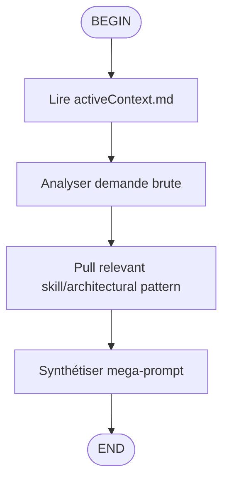

## Usage
/flow:enhance

## Steps
1. **Charger le contexte**  
   - Appelle l'outil `fast_read_file` pour lire 'activeContext.md'.

2. **Analyser la demande brute**  
   - Analyse les besoins de la demande brute ({{{ input }}}).

3. **Récupérer les compétences pertinentes**  
   - Utiliser `fast_read_file` pour récupérer uniquement les compétences ou modèles architecturaux pertinents. Ne pas indexer l'ensemble du projet.

4. **Générer le mega-prompt**  
   - Synthétiser les informations dans le format obligatoire ci-dessous.

5. **Finaliser la réponse**  
   - Générer uniquement le bloc de code Markdown sans aucun texte supplémentaire.

## Format de Sortie Obligatoire
```markdown
# MISSION
[Description précise de la transformation en mega-prompt]

# CONTEXTE TECHNIQUE (via MCP)
[Résumé des fichiers lus : activeContext.md et skills spécialisés dans .windsurf/skills/]

# INSTRUCTIONS PAS-À-PAS
[Étapes pour l'IA suivante : analyse intention, chargement contexte, génération mega-prompt]

# CONTRAINTES
- Respecter codingstandards.md
- Ne pas casser l'architecture existante
- Utiliser uniquement les skills activés
```

## Règles Critiques
- Ne jamais exécuter la tâche demandée.
- Ne jamais modifier de fichier (edit_file).
- Ne jamais générer de code fonctionnel.
- La réponse doit être composée à 100% d'un unique bloc de code Markdown.

**Locking Instruction:** Utilisez les outils fast-filesystem (fast_*) pour accéder aux fichiers memory-bank avec des chemins absolus.