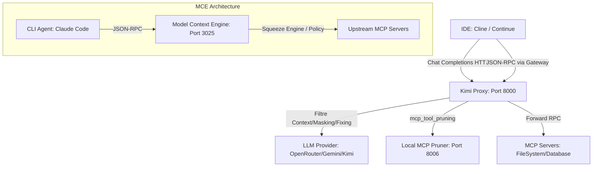

# Analyse comparative et opportunités d'intégration de Model Context Engine (MCE) dans Kimi Proxy

**TL;DR**: L'intégration de Model Context Engine (MCE) comme passerelle MCP enrichie permettrait d'apporter à Kimi Proxy un **moteur de RAG local CPU-friendly (Layer 2)**, un **circuit breaker anti-boucle par similarité Jaccard**, et un **cache sémantique auto-invalidable**. Ces synergies optimiseraient la consommation de tokens et élimineraient les requêtes redondantes localement à coût zéro.

## Deux philosophies pour un même combat

Vous développez une application de code complexe; soudain, votre session s'interrompt car la limite de tokens du LLM a été atteinte; ou pire, vous observez votre agent CLI tourner en boucle à essayer de lire le même dossier en boucle suite à une erreur mineure. C'est pour résoudre ce gaspillage de bande passante et d'argent que Kimi Proxy et Model Context Engine ont été conçus. Cependant, ils s'attaquent à ce problème sous des angles différents.

Kimi Proxy agit comme un **filtre à eau global au niveau de l'API LLM**; il intercepte les requêtes de chat completions de votre IDE (Cline, Continue.dev), masque les anciennes observations verbeuses par des empreintes uniques récupérables à la volée, et corrige les appels d'outils malformés avant qu'ils ne parviennent au provider.

À l'inverse, Model Context Engine (MCE) opère comme un **proxy inverse transparent au niveau du protocole MCP (JSON-RPC)**. Il intercepte les réponses des serveurs MCP avant qu'elles ne soient retournées à l'agent, et leur applique un algorithme de compression progressif en trois couches (le Squeeze Engine).

### Positionnement dans la chaîne de traitement

Voici comment les deux solutions se positionnent par rapport à l'agent de développement:



---

## Tableau de comparaison technique

Pour bien comprendre les différences fonctionnelles, voici un comparatif direct:

| Dimension / Fonctionnalité | Model Context Engine (MCE) | Kimi Proxy & MCP-Pruner |
| :--- | :--- | :--- |
| **Niveau d'interception** | MCP JSON-RPC (`localhost:3025`) | LLM Chat Completions (`localhost:8000`) & MCP Gateway |
| **Pruning de texte** | **Squeeze Engine** (3 Couches):<br>1. Pruner déterministe (HTML->MD, base64 strip)<br>2. RAG local CPU (`sentence-transformers` + `NumPy`) & extraction cosinus<br>3. Synthétiseur local (Ollama Qwen 2.5 3B) | **Context Sanitizer** & **mcp-pruner**:<br>1. Masquage de l'historique par hash & API de restauration<br>2. Pruner MCP (heuristiques de lignes + RAG cloud optionnel via DeepInfra) |
| **Mécanisme de Cache** | **Cache Sémantique** in-memory avec **invalidation par mutation** (les outils comme `write_file` ou `edit_file` invalident le cache). | **Cache d'outils MCP** (TTL fixe de 5 min) + **Store de masques** indexé par hash. |
| **Prévention des boucles** | **Circuit Breaker** par sliding window et calcul de la **similarité Token Jaccard** ($\ge 85\%$) sur les arguments consécutifs en erreur. | Gestion résiliente par tool-fixing, timeouts et streaming robuste. |
| **Règles de sécurité** | **Policy Engine**: Regex de commandes destructives (`rm -rf`) et invite interactive **Human-in-the-Loop** (HitL) dans le terminal. | Relie la sécurité aux configurations de l'agent client (Cline/Continue). |
| **Gestion du Registre** | **Lazy Registrar**: Meta-outils (`search_tools`, `discover_capabilities`, `release_capabilities`) pour charger et décharger les schémas JIT afin de libérer de l'espace. | Configuration fixe des serveurs locaux dans `mcp_gateway_rpc.py`. |

---

## Zoom sur trois concepts brillants de MCE

Pour enrichir Kimi Proxy, certains choix d'implémentation de MCE se révèlent particulièrement instructifs.

### 1. Le Circuit Breaker intelligent par Token Jaccard
Les boucles de retry infinies sont la hantise des utilisateurs d'agents. Kimi Proxy pourrait grandement bénéficier du Circuit Breaker de MCE. Au lieu de simplement bloquer après un certain temps, MCE utilise une fenêtre glissante de 5 appels et calcule l'indice de Jaccard sur les arguments JSON des outils en échec.

```python
# Exemple conceptuel d'application de similarité Jaccard sur des arguments d'outils
def compute_jaccard_similarity(args1: dict, args2: dict) -> float:
    # Tokenisation rudimentaire des clés/valeurs sous forme d'ensemble
    tokens1 = set(str(args1).lower().split())
    tokens2 = set(str(args2).lower().split())
    
    intersection = len(tokens1.intersection(tokens2))
    union = len(tokens1.union(tokens2))
    
    return intersection / union if union > 0 else 0.0
```

Si le même outil échoue consécutivement avec des arguments similaires à plus de 85% (par exemple, de simples changements d'espaces ou d'options d'affichage), Kimi Proxy pourrait intercepter la réponse de son `mcp-gateway` et lever une exception explicite forçant le LLM à s'arrêter plutôt que de vider le portefeuille de l'utilisateur.

### 2. Le cache sémantique sensible aux mutations de l'état
Un cache de lecture (comme `fast_read_file` ou `fast_list_directory`) est parfait, jusqu'à ce que l'agent écrive ou modifie un fichier. Si le cache n'est pas conscient de cette écriture, le LLM travaillera sur un code obsolète.

MCE résout ce problème de façon robuste:
- **En écriture**: Dès qu'un outil modificateur (ex: `write_file`, `edit_file`, `execute_command`) réussit, le cache sémantique est entièrement purgé.
- **En lecture**: Le hachage des arguments est ordonné pour garantir que `{"path": "a", "lines": [1, 2]}` et `{"lines": [1, 2], "path": "a"}` partagent la même clé de cache.

### 3. Le RAG local CPU-friendly pour le Pruner
Actuellement, le pruner de Kimi Proxy (`mcp-pruner`) s'appuie soit sur des regex de filtrage heuristique, soit sur un appel API externe (DeepInfra). 

MCE propose une couche intermédiaire locale gratuite: **un mini-RAG exécuté sur CPU**.
En utilisant un modèle très léger comme `all-MiniLM-L6-v2` via `sentence-transformers` et une structure mathématique simple en `NumPy` pour le calcul de la similarité cosinus, il découpe les observations volumineuses en fragments de 500 tokens et ne renvoie que les morceaux les plus corrélés à l'intention de l'utilisateur (`goal_hint`). Cela évite les lenteurs réseau et les coûts des APIs cloud de pruning.

---

## Scénarios de complémentarité : Comment les marier ?

Nous pouvons imaginer deux scénarios d'intégration de MCE au sein de l'écosystème Kimi Proxy.

### Scénario A: Le Gateway MCP de Kimi Proxy délègue à MCE (Hybride)
Dans cette configuration, Kimi Proxy conserve son rôle de proxy LLM (`localhost:8000`) indispensable pour Cline/Continue. Cependant, au lieu de gérer elle-même la liste statique des serveurs MCP locaux et d'appeler `mcp-pruner` de manière isolée, la route `/api/mcp-gateway/...` délègue les appels d'outils complexes directement à l'instance locale de MCE.

```
Cline ──> Kimi Proxy (LLM Proxy) ──> Provider (OpenRouter)
             │
             ├──> (Appel outil MCP)
             ▼
       MCE Gateway (localhost:3025)
             ├──> Policy Engine & Sandboxing
             ├──> Circuit Breaker & Semantic Cache
             └── Squeeze Engine ──> Serveurs MCP (fast-filesystem, etc.)
```

**Avantages**:
- Découplage total: Kimi Proxy s'occupe de la conformité du chat et de la sécurité des tokens au niveau macro, MCE sécurise et compresse le flux de données micro (les outils).
- Zéro configuration dans l'IDE pour les outils.

### Scénario B: Fusion des fonctionnalités (Bénéfices mutuels)
Si nous souhaitons conserver Kimi Proxy comme un projet autonome et unifié, nous pouvons implémenter directement ses meilleures idées sous forme de nouveaux modules ou services dans Kimi Proxy:

1. **Intégration du RAG Local dans `mcp-pruner`**:
   Remplacer l'alternative DeepInfra par un moteur local s'appuyant sur `sentence-transformers` et un `VectorStore` NumPy léger (dans `src/kimi_proxy/features/mcp_pruner/local_rag.py`).
2. **Implémentation du Cache Réactif dans le Gateway**:
   Ajouter la détection automatique des verbes de mutation (les requêtes d'écriture) dans `MCPExternalClient.call_mcp_tool` pour invalider sélectivement le cache des lectures de fichiers.
3. **Mise en place du Circuit Breaker**:
   Ajouter une classe de surveillance dans `src/kimi_proxy/features/mcp/detector.py` qui compare les paramètres des appels JSON-RPC successifs via Token Jaccard Similarity et lève un code d'erreur standardisé en cas de boucle logique.

---

## La Règle d'Or: Préservation de l'autonomie locale

En conclusion, Kimi Proxy et MCE partagent la même obsession: **rendre les agents autonomes viables financièrement et techniquement**. 

L'approche de MCE axée sur l'optimisation *locale et en temps réel* des réponses d'outils est le complément parfait de la stratégie *stateless et macro* de Kimi Proxy. En croisant leurs forces, nous pouvons obtenir un middleware de développement ultra-optimisé, sécurisé et totalement à l'abri des factures de tokens exorbitantes ou des boucles de retry infinies.
