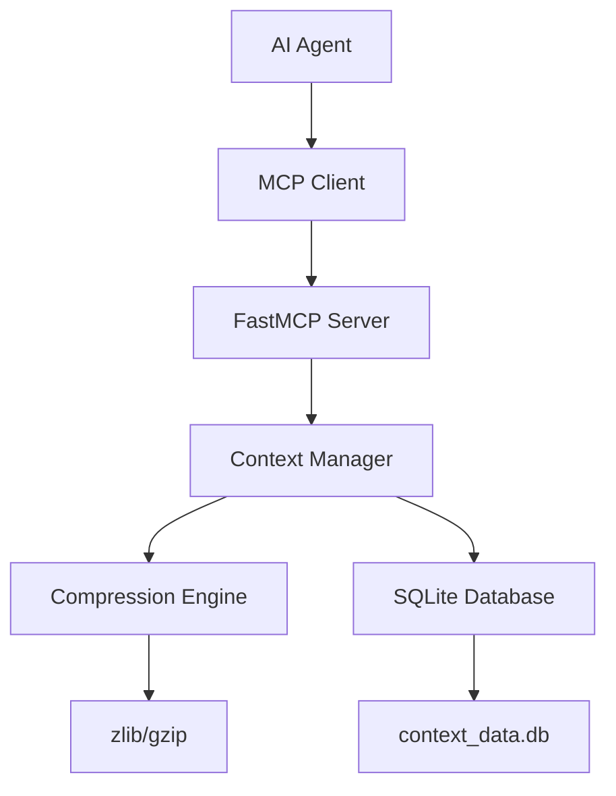
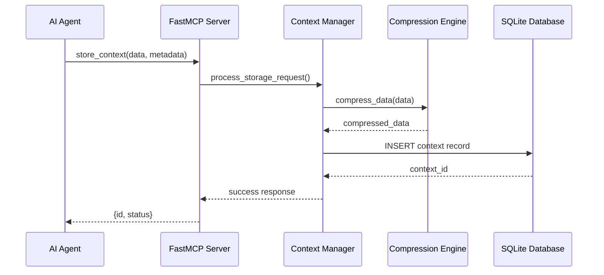

# Design Document

## Overview

The Context Compression MCP Server is built using FastMCP framework and provides AI agents with tools to store, compress, and retrieve contextual data using SQLite as the backend database. The system addresses context window limitations by allowing agents to offload large amounts of contextual information to persistent storage and retrieve it on demand.

## Architecture

### High-Level Architecture



### Component Interaction Flow



## Components and Interfaces

### 1. FastMCP Server (server.py)

**Responsibilities:**
- Initialize MCP server with context management tools
- Handle MCP tool requests and responses
- Provide error handling and validation

**Key Tools:**
- `store_context(data: str, title: str = None, tags: list = None) -> dict`
- `retrieve_context(context_id: str) -> dict`
- `search_contexts(query: str, limit: int = 10) -> list`
- `list_contexts(limit: int = 50, offset: int = 0) -> list`
- `delete_context(context_id: str) -> dict`
- `update_context(context_id: str, data: str = None, title: str = None, tags: list = None) -> dict`

### 2. Context Manager (context_manager.py)

**Responsibilities:**
- Coordinate between compression engine and database
- Manage context metadata and lifecycle
- Handle business logic for context operations

**Key Methods:**
```python
class ContextManager:
    def store_context(self, data: str, title: str = None, tags: list = None) -> str
    def retrieve_context(self, context_id: str) -> dict
    def search_contexts(self, query: str, limit: int = 10) -> list
    def list_contexts(self, limit: int = 50, offset: int = 0) -> list
    def delete_context(self, context_id: str) -> bool
    def update_context(self, context_id: str, **kwargs) -> bool
```

### 3. Compression Engine (compression.py)

**Responsibilities:**
- Compress and decompress context data
- Handle different compression algorithms
- Optimize compression ratios vs speed

**Key Methods:**
```python
class CompressionEngine:
    def compress(self, data: str) -> bytes
    def decompress(self, compressed_data: bytes) -> str
    def get_compression_ratio(self, original_size: int, compressed_size: int) -> float
```

**Compression Strategy:**
- Primary: zlib (good balance of speed and compression)
- Fallback: Store uncompressed if compression doesn't provide significant benefit
- Threshold: Only compress if data > 1KB and compression ratio > 20%

### 4. Database Manager (database.py)

**Responsibilities:**
- Handle SQLite database operations
- Manage database schema and migrations
- Provide thread-safe database access

**Database Schema:**
```sql
CREATE TABLE contexts (
    id TEXT PRIMARY KEY,
    title TEXT,
    original_size INTEGER NOT NULL,
    compressed_size INTEGER NOT NULL,
    compression_method TEXT NOT NULL,
    data BLOB NOT NULL,
    tags TEXT, -- JSON array of tags
    created_at TIMESTAMP DEFAULT CURRENT_TIMESTAMP,
    updated_at TIMESTAMP DEFAULT CURRENT_TIMESTAMP
);

CREATE INDEX idx_contexts_title ON contexts(title);
CREATE INDEX idx_contexts_created_at ON contexts(created_at);
CREATE INDEX idx_contexts_tags ON contexts(tags);
```

## Data Models

### Context Record
```python
@dataclass
class ContextRecord:
    id: str
    title: Optional[str]
    original_size: int
    compressed_size: int
    compression_method: str
    data: bytes
    tags: List[str]
    created_at: datetime
    updated_at: datetime
```

### MCP Tool Responses
```python
# Store Context Response
{
    "id": "ctx_1234567890",
    "status": "success",
    "original_size": 5000,
    "compressed_size": 1200,
    "compression_ratio": 0.24
}

# Retrieve Context Response
{
    "id": "ctx_1234567890",
    "title": "API Documentation Context",
    "data": "...", # Original uncompressed data
    "tags": ["api", "documentation"],
    "metadata": {
        "original_size": 5000,
        "compressed_size": 1200,
        "compression_method": "zlib",
        "created_at": "2024-01-15T10:30:00Z",
        "updated_at": "2024-01-15T10:30:00Z"
    }
}
```

## Error Handling

### Error Categories
1. **Validation Errors**: Invalid input parameters
2. **Database Errors**: SQLite operation failures
3. **Compression Errors**: Data compression/decompression failures
4. **Not Found Errors**: Requested context doesn't exist

### Error Response Format
```python
{
    "status": "error",
    "error_code": "CONTEXT_NOT_FOUND",
    "message": "Context with ID 'ctx_123' not found",
    "details": {}
}
```

### Error Handling Strategy
- Use try-catch blocks around all database operations
- Implement connection pooling and retry logic for database
- Validate all inputs before processing
- Log errors for debugging while returning user-friendly messages

## Testing Strategy

### Unit Tests
- **Context Manager**: Test all CRUD operations
- **Compression Engine**: Test compression/decompression with various data sizes
- **Database Manager**: Test schema creation, queries, and error conditions
- **MCP Tools**: Test tool parameter validation and response formats

### Integration Tests
- **End-to-End Workflows**: Store → Retrieve → Verify data integrity
- **Concurrent Access**: Multiple simultaneous operations
- **Large Data Handling**: Test with various data sizes (1KB to 1MB)
- **Database Migration**: Test schema updates and data preservation

### Performance Tests
- **Compression Performance**: Measure compression speed vs ratio
- **Database Performance**: Query performance with large datasets
- **Memory Usage**: Monitor memory consumption during operations

### Test Data Strategy
- Use synthetic data of various sizes and types
- Include edge cases (empty strings, very large texts, special characters)
- Test with realistic AI context data (code, documentation, conversations)

## Deployment and Configuration

### Dependencies
```toml
dependencies = [
    "fastmcp>=2.11.3",
    "sqlite3", # Built into Python
    "uuid", # Built into Python
    "json", # Built into Python
    "datetime", # Built into Python
    "zlib", # Built into Python
]
```

### Configuration
- Database file location: `./context_data.db` (configurable via environment variable)
- Default compression threshold: 1KB
- Default compression method: zlib
- Maximum context size: 10MB
- Database connection timeout: 30 seconds

### GitHub Repository Structure
```
context-compression-mcp/
├── README.md
├── pyproject.toml
├── server.py
├── src/
│   ├── context_manager.py
│   ├── compression.py
│   └── database.py
├── tests/
│   ├── test_context_manager.py
│   ├── test_compression.py
│   └── test_database.py
└── .gitignore
```