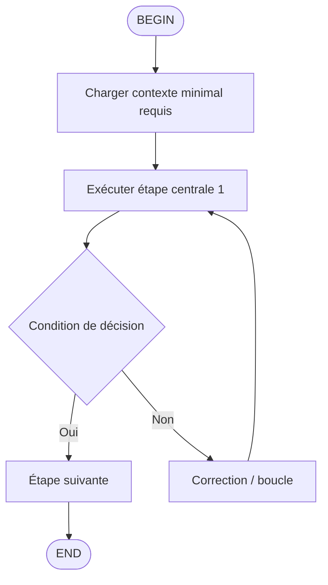

# Mega-Prompt — Conversion des workflows `.windsurf/workflows` en skills Kimi Code

```markdown
# MISSION
Transformer chaque workflow source situé dans `/home/kidpixel/kimi-proxy/.windsurf/workflows/*.md` en skill autonome Kimi Code, avec création d’un dossier par skill dans `/home/kidpixel/kimi-proxy/.agents/skills/<skill-name>/` et génération d’un `SKILL.md` compatible découverte automatique Kimi Code.

Objectif de migration : préserver la logique métier de chaque slash commande historique (`/commit-push`, `/docs-updater`, `/end`, `/enhance`, `/enhance_complex`) tout en la rendant invocable via le système skills Kimi Code (`/skill:<name>` et, si pertinent, `/flow:<name>`).

# CONTEXTE TECHNIQUE (via MCP)
## Sources à convertir (chemins absolus)
- `/home/kidpixel/kimi-proxy/.windsurf/workflows/commit-push.md`
- `/home/kidpixel/kimi-proxy/.windsurf/workflows/docs-updater.md`
- `/home/kidpixel/kimi-proxy/.windsurf/workflows/end.md`
- `/home/kidpixel/kimi-proxy/.windsurf/workflows/enhance.md`
- `/home/kidpixel/kimi-proxy/.windsurf/workflows/enhance_complex.md`

## Destination skills (chemin absolu)
- Racine : `/home/kidpixel/kimi-proxy/.agents/skills`
- Un dossier par skill : `/home/kidpixel/kimi-proxy/.agents/skills/<nom-skill>/SKILL.md`

## Règles Kimi Code à respecter
- Format minimum obligatoire d’un skill : dossier + fichier `SKILL.md`.
- `SKILL.md` contient un frontmatter YAML puis des instructions Markdown.
- Frontmatter recommandé :
  - `name` (kebab-case)
  - `description`
  - `type: flow` uniquement si le skill doit exécuter un flow multi-tours.
- Invocation Kimi Code :
  - `/skill:<name>` pour charger les instructions
  - `/flow:<name>` uniquement pour les flow skills (`type: flow` + diagramme Mermaid/D2)

## Mapping de conversion attendu
| Workflow source | Skill cible | Type conseillé | Invocation cible |
|---|---|---|---|
| `/commit-push` | `commit-push` | standard | `/skill:commit-push` |
| `/docs-updater` | `docs-updater` | flow (recommandé) | `/flow:docs-updater` + `/skill:docs-updater` |
| `/end` | `end-session-memory-bank` | standard | `/skill:end-session-memory-bank` |
| `/enhance` | `enhance-prompt` | standard | `/skill:enhance-prompt` |
| `/enhance_complex` | `enhance-complex-architect` | flow (recommandé) | `/flow:enhance-complex-architect` + `/skill:enhance-complex-architect` |

# INSTRUCTIONS PAS-À-PAS
## 1) Analyse et extraction workflow par workflow
Pour chaque fichier source :
1. Lire le frontmatter YAML (`description`) et le corps Markdown.
2. Identifier :
   - rôle attendu
   - règles strictes (NEVER/DO NOT)
   - séquence d’étapes
   - outils autorisés/interdits
   - format de sortie attendu
3. Marquer les éléments qui doivent être conservés à l’identique (verrous de sécurité, contraintes d’exécution, instructions de contexte mémoire).

## 2) Création de la structure skills
Créer les dossiers suivants :
- `/home/kidpixel/kimi-proxy/.agents/skills/commit-push/`
- `/home/kidpixel/kimi-proxy/.agents/skills/docs-updater/`
- `/home/kidpixel/kimi-proxy/.agents/skills/end-session-memory-bank/`
- `/home/kidpixel/kimi-proxy/.agents/skills/enhance-prompt/`
- `/home/kidpixel/kimi-proxy/.agents/skills/enhance-complex-architect/`

## 3) Gabarit SKILL.md — standard
Utiliser ce squelette pour les skills standards :

```markdown
---
name: <skill-name>
description: <description claire, actionnable>
metadata:
  source_workflow: </home/kidpixel/kimi-proxy/.windsurf/workflows/...>
  legacy_slash_command: </nom-commande>
  invocation:
    - /skill:<skill-name>
---

# Purpose
Objectif opérationnel du skill.

# When to Use
Cas d’usage explicites + anti-cas.

# Inputs
Entrées attendues (arguments utilisateur, contexte, fichiers).

# Workflow
Étapes ordonnées et impératives.

# Guardrails
Interdictions, sécurité, conditions d’arrêt.

# Output Contract
Format exact de la réponse attendue.
```

## 4) Gabarit SKILL.md — flow
Utiliser ce squelette pour les skills flow (`docs-updater`, `enhance-complex-architect`) :

```markdown
---
name: <skill-name>
description: <description claire>
type: flow
metadata:
  source_workflow: </home/kidpixel/kimi-proxy/.windsurf/workflows/...>
  legacy_slash_command: </nom-commande>
  invocation:
    - /flow:<skill-name>
    - /skill:<skill-name>
---

# Flow Overview
Résumé du processus automatisé.



# Node Details
## B
Instruction détaillée.
## C
Instruction détaillée.
## D
Critères de décision (sortie attendue `<choice>Oui</choice>` ou `<choice>Non</choice>`).
```

## 5) Règles de transformation spécifiques par workflow
### A. `commit-push.md` → `commit-push/SKILL.md`
- Préserver la logique non-interactive : quality checks -> `git add -A` -> `git commit` -> `git push`.
- Conserver la référence au format de commit (`/home/kidpixel/kimi-proxy/.windsurf/rules/commit-message-format.md`).
- Ajouter garde-fous : vérifier branche courante, refuser commit vide, proposer `git status` avant push.

### B. `docs-updater.md` → `docs-updater/SKILL.md` (flow)
- Préserver les protocoles critiques (outils autorisés, source de vérité, sécurité memory-bank).
- Convertir les étapes 1→5 en nœuds de flow.
- Intégrer checkpoints du skill documentation (TL;DR, problem-first, ❌/✅, trade-offs, Golden Rule).
- Exiger chemins absolus pour memory-bank.

### C. `end.md` → `end-session-memory-bank/SKILL.md`
- Préserver la séquence : charger contexte minimal -> appliquer protocoles memory bank -> update -> clôture.
- Garder contrainte de lecture sélective (`activeContext.md` + `progress.md` prioritairement).
- Exiger vérification finale de l’état neutre (`Aucune tâche active`).

### D. `enhance.md` → `enhance-prompt/SKILL.md`
- Préserver le rôle Prompt Engineer et la sortie « bloc Markdown unique ».
- Conserver les interdictions : ne pas exécuter la tâche, ne pas modifier de fichier, ne pas générer de code fonctionnel.
- Conserver le format de sortie imposé (`MISSION`, `CONTEXTE TECHNIQUE`, `INSTRUCTIONS`, `CONTRAINTES`).

### E. `enhance_complex.md` → `enhance-complex-architect/SKILL.md` (flow)
- Préserver les phases : contexte -> planification Shrimp -> réflexion séquentielle -> implémentation étagée -> vérification.
- Conserver les outils shrimp-task-manager explicitement listés.
- Conserver la contrainte de sortie « bloc Markdown unique » pour la phase de cadrage.

## 6) Triggers et compatibilité slash commandes
Pour chaque skill, inclure une section `Legacy Trigger Mapping` :
- Ancien trigger : `/nom-workflow`
- Nouveau trigger standard : `/skill:<skill-name>`
- Nouveau trigger flow (si `type: flow`) : `/flow:<skill-name>`

Ne jamais conserver les anciennes slash commandes comme mécanisme natif d’exécution.
Elles doivent uniquement être documentées comme compatibilité/migration.

## 7) Validation finale obligatoire
1. Vérifier que chaque dossier contient exactement un `SKILL.md` valide.
2. Vérifier frontmatter YAML parsable (pas de clé vide, pas d’indentation invalide).
3. Vérifier conformité naming : kebab-case, cohérence nom dossier = `name`.
4. Vérifier que les flow skills contiennent :
   - `type: flow`
   - un bloc Mermaid ou D2
   - un `BEGIN` et un `END`
5. Vérifier que chaque skill mentionne son fichier source absolu.
6. Vérifier que la logique de chaque workflow est préservée sans dilution.

## 8) Critères d’acceptation
- 5 skills générés dans `/home/kidpixel/kimi-proxy/.agents/skills`.
- Chaque skill est autonome, actionnable, et aligné Kimi Code.
- Les workflows d’origine sont convertis sans perte de contraintes critiques.
- La migration des triggers est documentée et explicite.
- Aucun changement de logique métier implicite.

# CONTRAINTES
- Respecter strictement `/home/kidpixel/kimi-proxy/.clinerules/codingstandards.md`.
- Maintenir l’isolation d’architecture 5 couches (API/Services/Features/Proxy/Core).
- Ne pas introduire d’anti-patterns : sync I/O bloquant, `Any`, global state, imports circulaires, silent catch.
- Utiliser uniquement les skills activés pour la rédaction/planification :
  - `documentation`
  - `shrimp-task-manager`
  - `sequentialthinking-logic`
- Toujours citer les fichiers avec chemins absolus lors de la conversion et de la traçabilité.
```
