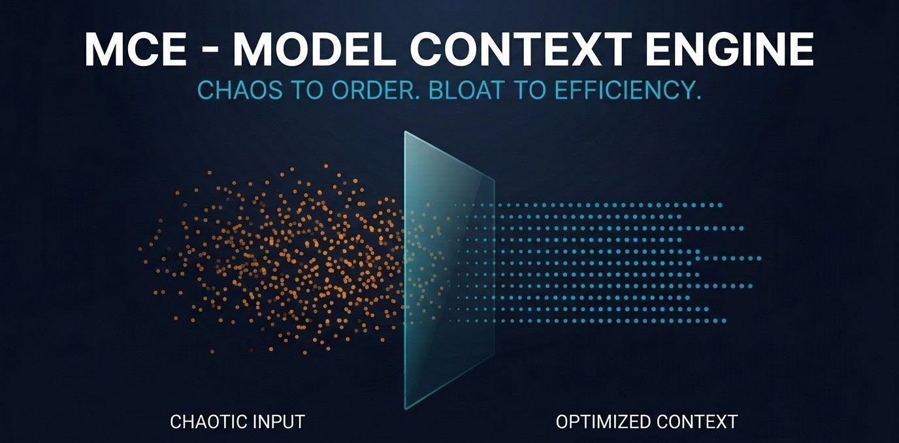

<div align="center">



# Model Context Engine

**Token-aware transparent proxy that eliminates context window bloat for AI agents.**

[](LICENSE)
[](https://www.python.org/downloads/)
[](https://github.com/DexopT/MCE/releases)

</div>

---

## The Problem

AI agents (Claude Code, Cursor, Windsurf) waste **40-80% of their context window** on bloated tool responses — raw HTML, base64 blobs, null fields, truncated arrays. Every wasted token costs you money, slows down inference, and pushes important context out of the window.

## The Solution

MCE sits as a **transparent reverse proxy** between your AI agent and MCP tool servers. It intercepts every tool response, evaluates its token cost, and applies a 3-layer compression pipeline — all at near-zero latency on standard hardware.

```
┌──────────┐     JSON-RPC     ┌──────────┐     JSON-RPC     ┌──────────────┐
│ AI Agent │ ───────────────→ │   MCE    │ ───────────────→ │  MCP Server  │
│          │ ←─── minified ── │  Proxy   │ ←─── raw ─────── │  (Tool)      │
└──────────┘                  └──────────┘                  └──────────────┘
                                  │
                          ┌───────┴───────┐
                          │ Squeeze Engine │
                          │  L1: Pruner   │
                          │  L2: Semantic │
                          │  L3: Synth.   │
                          └───────────────┘
```

### What MCE Does

- 🧹 **Prunes waste** — strips HTML, base64 blobs, null values, excessive whitespace
- 🧠 **Semantic filtering** — extracts only relevant chunks via CPU-friendly RAG
- 📝 **Optional LLM summary** — routes to a local model (Ollama) for final compression
- 💾 **Semantic caching** — zero-token responses for repeated requests (automatically cleared on state mutations)
- 🔒 **Policy engine** — blocks destructive commands (`rm -rf`, `DROP TABLE`)
- 🔄 **Circuit breaker** — trips on identical or fuzzy-similar ($Jaccard \ge 85\%$) consecutive tool errors (transport or logical `isError`)
- 🔌 **Dynamic Meta-Tools** — dynamic capability registry search (`search_tools`) and domain unloading (`release_capabilities`)
- 📊 **Live dashboard** — real-time TUI showing token savings and cache stats

---

## Quick Start

### 1. Install

```bash
git clone https://github.com/DexopT/MCE.git
cd MCE/mce-core
pip install -r requirements.txt
```

### 2. Configure

Edit `config.yaml` — point MCE at your actual MCP servers:

```yaml
upstream_servers:
  - name: "filesystem"
    url: "http://localhost:3001"

token_limits:
  safe_limit: 1000       # pass through if under
  squeeze_trigger: 2000  # compress if over
  absolute_max: 8000     # hard cap
```

### 3. Run

```bash
python main.py                # start the proxy
python main.py --dashboard    # start with live TUI dashboard
```

### 4. Connect your agent

Point your AI agent's MCP configuration to `http://127.0.0.1:3025` instead of the direct tool server URL. MCE proxies everything transparently.

---

## Architecture

| Component | File | Purpose |
|-----------|------|---------|
| **Proxy Server** | `core/proxy_server.py` | FastAPI JSON-RPC reverse proxy |
| **MCP Client** | `core/mcp_client.py` | Forwards calls to real tool servers |
| **Token Economist** | `engine/token_economist.py` | Budget guardrails via tiktoken |
| **Policy Engine** | `engine/policy_engine.py` | Destructive command blocker + HitL |
| **Circuit Breaker** | `engine/circuit_breaker.py` | Infinite loop detector |
| **Lazy Registrar** | `engine/lazy_registrar.py` | Just-in-Time schema injection |
| **L1 Pruner** | `engine/squeeze/layer1_pruner.py` | HTML→MD, null strip, base64 removal |
| **L2 Semantic** | `engine/squeeze/layer2_semantic.py` | CPU-friendly RAG filtering |
| **L3 Synthesizer** | `engine/squeeze/layer3_synthesizer.py` | Optional local LLM summary (Ollama) |
| **Semantic Cache** | `models/semantic_cache.py` | LRU + TTL response cache |
| **Context Manager** | `core/context_manager.py` | Session token tracking |
| **TUI Dashboard** | `tui/dashboard.py` | Real-time Rich terminal dashboard |

### Squeeze Engine Pipeline

```
Raw Response (e.g., 12,000 tokens)
        │
        ▼
┌─── Layer 1: Pruner ────────────────┐
│  HTML → Markdown                   │
│  Strip base64 blobs                │
│  Remove null values                │
│  Truncate arrays (50 items max)    │
│  Normalize whitespace              │
└────────────────────────────────────┘
        │  ~4,000 tokens
        ▼
┌─── Layer 2: Semantic Router ───────┐
│  Chunk text (500 tokens each)      │
│  Embed chunks + agent query        │
│  Cosine similarity search          │
│  Return top-5 relevant chunks      │
└────────────────────────────────────┘
        │  ~1,500 tokens
        ▼
┌─── Layer 3: Synthesizer (opt.) ────┐
│  Send to Ollama (Qwen 2.5 3B)     │
│  Generate 300-token summary        │
│  Graceful fallback if unavailable  │
└────────────────────────────────────┘
        │  ~300 tokens (97.5% reduction)
        ▼
   Minified Response → Agent
```

---

## Configuration Reference

<details>
<summary>Full <code>config.yaml</code> reference</summary>

```yaml
proxy:
  host: "127.0.0.1"
  port: 3025

token_limits:
  safe_limit: 1000          # pass through if under
  squeeze_trigger: 2000     # route to squeeze engine
  absolute_max: 8000        # hard cap after squeeze

squeeze:
  layer1_pruner: true        # deterministic pruning
  layer2_semantic: true      # semantic RAG filtering
  layer3_synthesizer: false  # requires Ollama

cache:
  enabled: true
  max_entries: 512
  ttl_seconds: 600

upstream_servers:
  - name: "filesystem"
    url: "http://localhost:3001"

policy:
  blocked_commands:
    - "rm -rf"
    - "mkfs"
    - "FORMAT"
  blocked_network:
    - "0.0.0.0"
    - "169.254."
  hitl_commands:
    - "DROP"
    - "TRUNCATE"
    - "git push --force"

circuit_breaker:
  window_size: 5
  failure_threshold: 3

synthesizer:
  model: "qwen2.5:3b"
  ollama_url: "http://localhost:11434"
  max_summary_tokens: 300

embeddings:
  model_name: "all-MiniLM-L6-v2"

logging:
  level: "INFO"
  show_tokens: true
```

</details>

---

## Running Tests

```bash
cd mce-core
python -m pytest tests/ -v
```

---

## Tech Stack

- **Python 3.11+** — async runtime
- **FastAPI + Uvicorn** — high-performance async proxy
- **tiktoken** — OpenAI tokenizer for accurate token counting
- **sentence-transformers** — CPU-friendly embeddings (all-MiniLM-L6-v2)
- **NumPy** — in-memory vector store (no FAISS dependency)
- **httpx** — async HTTP client for upstream communication
- **Rich** — beautiful terminal logging and TUI dashboard
- **Pydantic v2** — type-safe configuration and schema validation

---

## Contributing

See [CONTRIBUTING.md](CONTRIBUTING.md) for guidelines.

## Security

See [SECURITY.md](SECURITY.md) for reporting vulnerabilities.

## License

This project is licensed under the MIT License — see [LICENSE](LICENSE) for details.


<div align="center">

**Built by [Yılmaz Karaağaç](https://github.com/DexopT)**

*If MCE saves your tokens, give it a ⭐*

</div>
